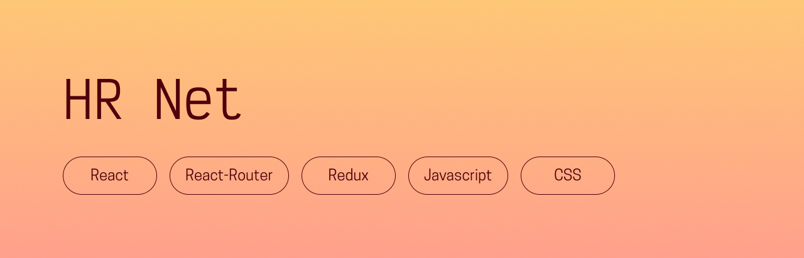

## Presentation
*This is a fictional project, which was project 14 of my OpenClassrooms front-end development program. You can visit the website [here](https://hrnet.chloeadrian.dev/)! Because of the scope of the project, it is best viewed on larger screens.*\
HRNet is a human resources app that allows users to view and sort a list of employees, as well as add some. It was originally made with jQuery, and I was asked to remake it with React and Redux. I could choose one of four components to make into a custom React library: the select form field, the date picker, the validation modal, and the employee table. I chose the table, which you can find and add to your own React projects [here](https://www.npmjs.com/package/@chloeadriancreates/custom-react-table). This 18kb component allows you to display complex data in a clean, color-customizable table, complete with pagination, a search system, and sorting by each category. I used Material UI for the three other components.

## Prerequisites
- [NodeJS (version 16.17.0)](https://nodejs.org/en/)
- [NPM (version 9.4.0)](https://www.npmjs.com/)

## Getting started
- Run `$ npm install` to install all dependencies
- Run `$ npm start` to see the project!

## Thanks for reading, and happy coding!  
Chloé Adrian
